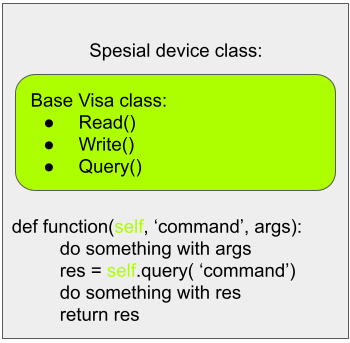

# Scientist-friendly driver for microwave low-temperature equipment in NANO lab Aalto

The goal of this project is to make building blocks that are easy to use for those who do
not have deep knowledge in programming.

This code could be optimized. This code could be made more literate.

But are these complications really so necessary when you need to test a sample
before it would expire?

[](https://mybinder.org/v2/gh/NanoYY/ColdMeasurements/HEAD)

****


<details>
<summary>
Visa-based drivers' structure
</summary>

    Visa (PyVisa) is a nice and super convenient way to communicate with any device. 
    It is the best choice. 


First of all what all devices can do? They can listen for commands and respond. So we can <span style="color:#7306f9;">__write__</span> and <span style="color:#ed06f9;">__read__</span>. 
If we would summ up this two commands so that we ask the device, we would end up with <span style="color:#13f908;">__query__</span>. 


<span style="color:#f9068c;"> NB! </span> Not all devices have <span style="color:#13f908;">query</span> command built in. 

Then we need to create an 'virtual device' - object of the device class. 
A general class that is built in PyVisa is ResourceManager. 
Here is an example of how to go through all available in the network devices. 

```
import pyvisa
rm = pyvisa.ResourceManager()
list_of_instrument = rm.list_resources()
for i in range(len(list_of_instrument)):
    my_instrument = rm.open_resource(list_of_instrument[i])
    try:
        listen = my_instrument.query('*IDN?')
        print(i, 'Found instrument at', list_of_instrument[i], '-> ', listen[:-2])
    except: pass
```

    Output:

    2 Found instrument at GPIB0::13::INSTR ->  Agilent Technologies,33510B,MY52200739,3.03-1.19-2.00-52-0
    5 Found instrument at GPIB0::18::INSTR ->  ANRITSU,MS2830A,6200847105,4.09.01
    11 Found instrument at GPIB0::26::INSTR ->  HEWLETT-PACKARD,33120A,0,7.0-5.0-1.
    14 Found instrument at GPIB0::30::INSTR ->  Stanford_Research_Systems,SR844,s/n48867,ver1.00

As one can see from the example, we asked the device a question "Who are you?" ('*IDN?') and received answers from devices present in the local network. 
It a general command supported by all Visa-based devices. 
In the very same manner all drivers are organized in this repository. 




All Visa devices have the following list of commands: 
https://rfmw.em.keysight.com/spdhelpfiles/truevolt/webhelp/US/Content/__I_SCPI/IEEE-488_Common_Commands.htm


</details>

<details>
<summary>
Complete absence of structure in Non Visa-based drivers'
</summary>

    Visa is a nice and super convenient 

</details>

<details>
<summary>
Some usefull links
</summary>

- A pretty extensive library of drivers
https://qcodes.github.io/Qcodes/index.html 

- LakeShore 370/372
https://lake-shore-python-driver.readthedocs.io/en/latest/index.html

</details>

****

<h1 align="center"> Currently available:

<h1 align="center"> <a href="https://en.wikipedia.org/wiki/Virtual_instrument_software_architecture" target="_blank">Visa drivers</a> 


| <sub> No. | <sub> Device                       | <sub> Model                             | <sub> Status |
|-----------|------------------------------------|-----------------------------------------|--------------|
|<sub>  1.  | <sub> Vector Network Analyzer      | <sub> Rohde-Schwarz, ZNB20-2Port        | <sub> 50%    |
| <sub> 2.  | <sub> Signal Analyzer              | <sub> ANRITSU MS2830A                   | <sub> 20%    |
| <sub> 3.  | <sub> Dynamic Signal Analyzer      | <sub> Stanford_Research_Systems, SR785  | <sub> 20%    |
| <sub> 4.  | <sub> Lock-In Amplifier            | <sub> Stanford_Research_Systems, SR844  | <sub> 20%    |
| <sub> 5.  | <sub> Arbitrary Waveform Generator | <sub> Agilent Technologies, 33510B      | <sub> 20%    |
| <sub> 6.  | <sub> Signal Generator             | <sub> AnaPico, APMS20G                  | <sub> 20%    |
| <sub> 7.  | <sub> DC Source                    | <sub> HEWLETT-PACKARD,33120A            | <sub> 90%    |


<h1 align="center">Non Visa drivers


| <sub> No | <sub> Device                 |<sub>  Model         | <sub> Status |
|----------|------------------------------|---------------------|--------------|
| <sub> 1. | <sub> Temperature controller | <sub> LakeShore 370 | <sub> 10%    |
| <sub> 2. | <sub> Digital attenuator     | <sub> Vaunix        | <sub> 100%   |
| <sub> 3. | <sub> Digital phase shifter  | <sub> Vaunix        | <sub> 90%    |

